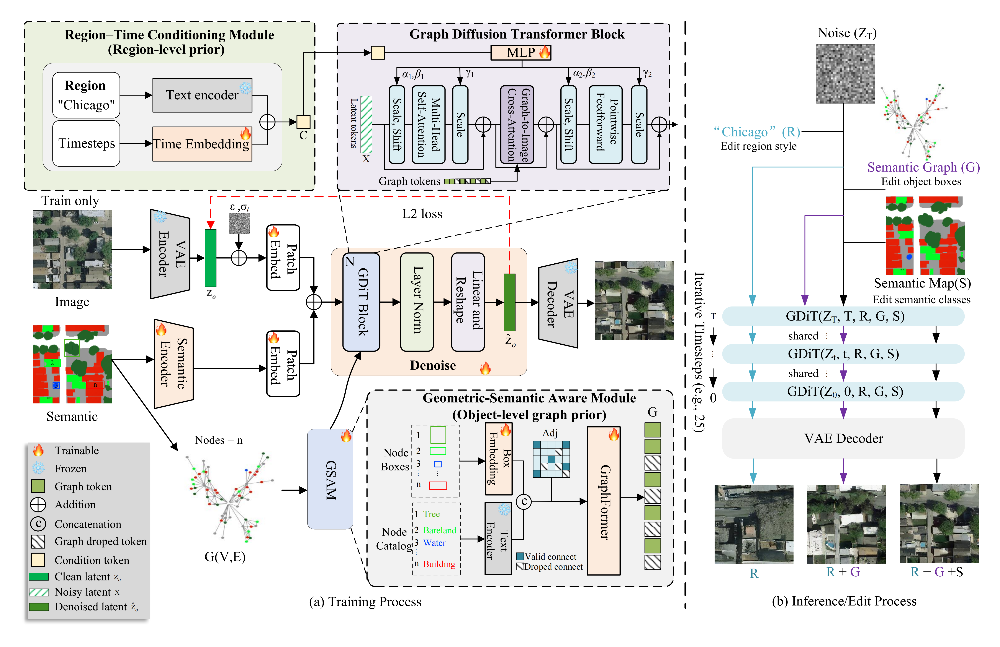

# GDiT: A Graph-Prior-Guided Diffusion Transformer for Semantic-Controllable Remote Sensing Image Synthesis
## Abstract
Semantic image synthesis (SIS) is essential for remote sensing, particularly in generating high-quality training data for scarce annotated datasets. While existing SIS methods have advanced pixel-wise mappings between semantic maps and images, they often overlook spatial priors, such as relationships between geographic objects (e.g., road-building adjacency), leading to structural inconsistencies in synthesized images. To address this, we propose the **graph-prior diffusion transformer (GDiT)** for semantically controllable remote sensing image synthesis. We first convert semantic maps into **semantic graphs**, encoding geographic objects as nodes with structured spatial interactions. To capture spatial and semantic relationships, we propose the **Geometric-Semantic Aware Module (GSAM)**, which integrates **CLIP-extracted semantics** and geometric attributes for a more context-aware representation. Furthermore, we design the **Graph Diffusion Transformer (GDiT) Block**, which employs **graph-to-image cross-attention** to refine spatial structures, ensuring topological coherence and semantic fidelity in synthesized images. Experiments on land-cover and land-use datasets show that GDiT achieves competitive performance and enables multilevel control across **global, object, and pixel** dimensions with text prompts, while using only **38.9%** of the parameters compared to GeoSynth, improving both efficiency and synthesis quality.

## 🧩 Method Overview
GDiT converts semantic maps into semantic graphs and injects graph priors into a diffusion transformer via graph-to-image cross-attention.
GSAM fuses CLIP semantics with geometric attributes to build context-aware node representations.
The GDiT Blocks refine spatial structures to ensure topological coherence and semantic fidelity during synthesis.




## Installation

    ```bash
    git clone https://github.com/whudk/GDiT.git
    cd GDiT
    conda create -n gdit python=3.10 -y
    conda activate gdit
    pip install torch torchvision --index-url https://download.pytorch.org/whl/cu118
    pip install -r requirements.txt
    pip install -e .
    ```
## 🏋️ Training

### Train on OEM (256, latent + seg + graph, AdaLn)
```bash
python train.py ^
  --gpu 0 ^
  --config .\configs\train\oem256-latent_seg_graph_with_graph_adaln.yaml ^
  --global-batch-size 10 ^
  --with-graph 1 ^
  --use_clip ^
  --version v_prompt ^
  --image-size 32 ^
  --mode regions_graph_sem
  ```

## 🧪 Evaluation / Sampling (OEM)

```bash
python sample.py 
  --config .\configs\train\oem256-latent_seg_graph_with_graph_adaln.yaml 
  --gpu 0 
  --outdir F:\M2I\comparision\GDiT_25_steps_OEMtest 
  --use_clip 
  --with-graph 1 
  --version GDiT 
  --eval_type regions_graph_sem 
  --num_steps 25 
  --seed 0-49999 
  --image_size 32 
  --cfg_scale 2.5 
  --ckpt-path "path\to\your_checkpoint.pt"
  ```

### Dataset Download:


## Dataset


## Citation

    ```bibtex
    @misc{deng2025gdit,
      title        = {GDiT: A Graph-Prior-Guided Diffusion Transformer for Semantic-Controllable Remote Sensing Image Synthesis},
      author       = {Deng, Kai and Hu, Xiangyun and Xiong, Yibing and Liang, Aokun and Xu, Jiong},
      year         = {2025},
      month        = oct,
      note         = {SSRN working paper},
      howpublished = {Available at SSRN},
      doi          = {10.2139/ssrn.5609404},
      url          = {https://ssrn.com/abstract=5609404}
    }
    ```


